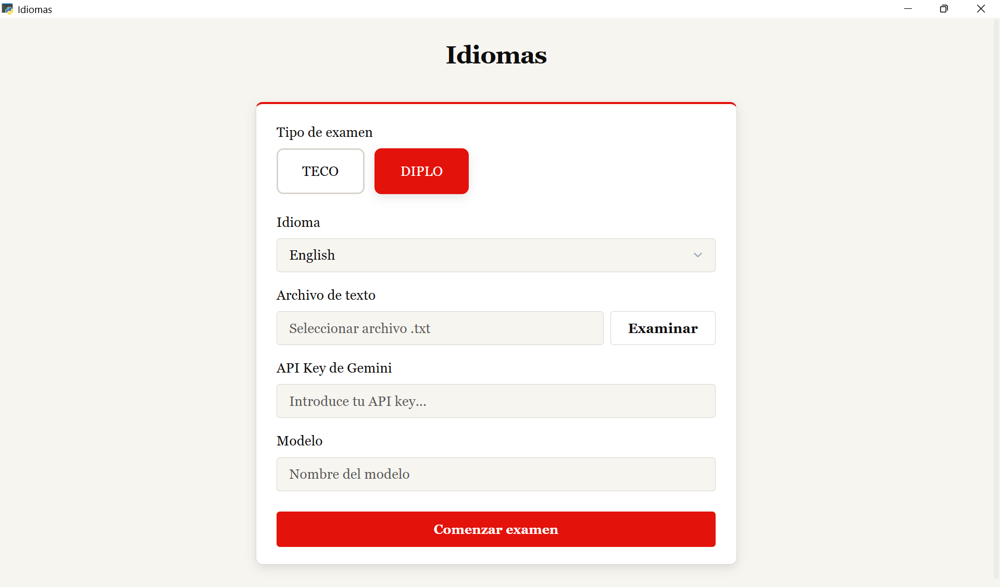

# Guía de uso

A continuación se explica cómo usar la aplicación, paso a paso.

---

## 1. Configuración inicial

Al abrir la aplicación, se muestra la siguiente pantalla de configuración:

### 1.1. Elegir el tipo de examen

*   **TECO:** 10 minutos de preparación.
*   **DIPLO:** 7 minutos de preparación.

La única diferencia en esta aplicación entre la práctica de TECO y DIPLO es el tiempo de preparación de la lectura del artículo.

### 1.2. Proporcionar un texto para el examen

La aplicación necesita un archivo de texto (`.txt`) para cargarse en la aplicación y generar las preguntas. Este es el texto sobre el que se basará el examen.

En la carpeta `Ejercicios de prueba` del proyecto encontrarás varios ejemplos con el formato correcto.

La aplicación solamente soporta el formato .txt. El formato .txt es el del bloc de notas.

Para el funcionamiento correcto de la aplicación, es necesario que los párrafos estén separados entre sí por una línea en blanco (fíjate en los textos de prueba de la carpeta). El texto que proporciones debe de tener al menos 4 párrafos, sin contar el título del texto.

### 1.3. Modelo de IA

En la aplicación hay un campo llamado **"Modelo"**. Este es el campo donde se indica a Google qué modelo de inteligencia artificial debe utilizar. El campo aparece rellenado por defecto con el modelo que personalmente considero más adecuado. No obstante, puedes cambiarlo si lo consideras necesario. Ten en cuenta que el modelo utilizado debe ser de Google (Gemini) necesariamente para que la aplicación funcione.

El modelo que se carga por defecto es **gemini-pro-latest**, es decir, el mejor modelo de Gemini disponible, porque es el que considero más adecuado para la profundidad de análisis requerida. No obstante, no es el más barato. Si quieres realizar el examen de la forma más económica posible, utiliza el modelo **gemini-flash-latest**.

## 2. Preparación

Una vez validada la configuración, aparecerá el texto del artículo que has proporcionado en pantalla. **El tiempo de preparación comienza inmediatamente en ese momento.**

La aplicación no muestra un cronómetro en pantalla: usa tu propio cronómetro para controlar el tiempo. 

Cuando finalice el tiempo, se te pedirá leer un párrafo al azar. La lectura del párrafo no es evaluada por la aplicación. 

## 3. Grabación del examen oral

*   Para grabar tu respuesta, haz click en el icono del círculo con un micrófono dentro. Una vez se termine de formular la pregunta, podrás hacer click sobre el icono, y se empezará a grabar tu respuesta. Cuando termines, vuelve a hacer click en el icono.
*   **Atajo recomendado:** Puedes usar también la **barra de espacio** para iniciar y detener la grabación. Es la opción más cómoda.
*   Las preguntas pueden repetirse una única vez pulsando el botón correspondiente.

## 4. Revisión

Después de responder a todas las preguntas, puedes **escuchar tus grabaciones** antes de enviarlas a evaluación.

Los archivos de audio de tus respuestas se guardan de forma temporal en el ordenador del usuario. **Al cerrar la aplicación, estos archivos se eliminan automáticamente.** Por lo tanto, si deseas escuchar tus respuestas, tienes que hacerlo en ese momento.

## 5. Informe de evaluación

La aplicación genera un **informe en PDF** para que lo guardes en tu ordenador. Si no lo guardas, **NO** podrás acceder a ese informe más adelante. 

El informe pdf incluye:

*   Las preguntas formuladas.
*   Tus respuestas transcritas.
*   Comentarios sobre tu desempeño.

